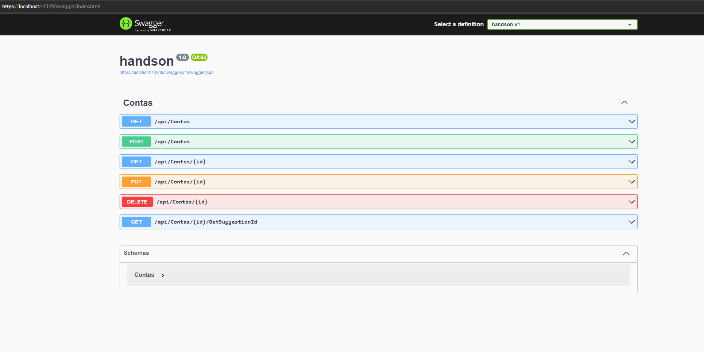

# handson

## Requerimentos

  * Visual Studio 2022 Community - https://visualstudio.microsoft.com/pt-br/downloads/
  * SQL Server 2019 Developer - https://www.microsoft.com/pt-br/sql-server/sql-server-downloads

## Configuração

### Banco de dados

  1. Mudar a linha 10 do arquivo Program.cs com a configuração do banco de dados
  2. Abrir o console do Gerenciador de Pacotes e escrever o seguinte comando:
	* Update-database -Context Context

### Compilação

  * Rodar pelo IIS Express no Visual Studio

### Output

A imagem abaixo deve aparecer com as funções implementadas na API

  

